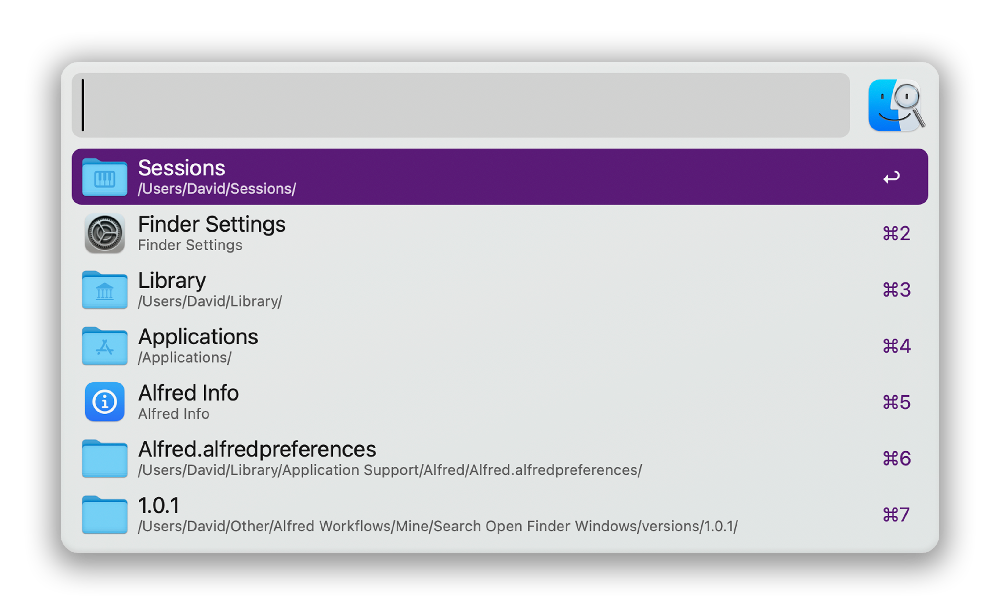
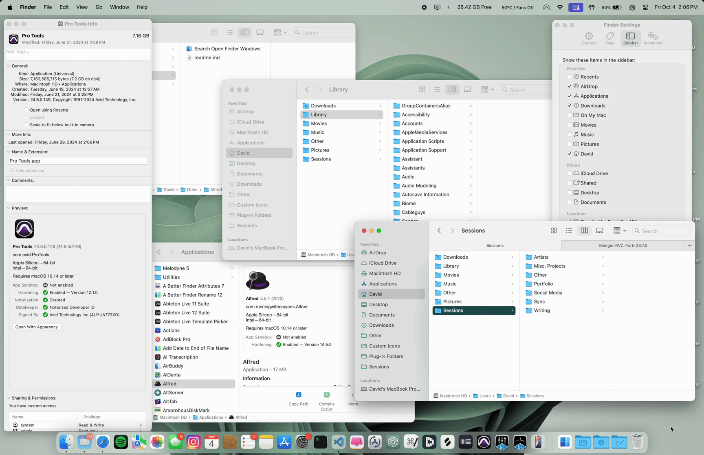

# Search Open Finder Windows — Alfred Workflow

Search a list of your open Finder windows, copy paths to their open directories, and close them.

Works with:

* `Finder browser` windows *(the standard ones with files and folders)*
* `Get Info` windows
* `Settings`/`Preferences` windows

### Usage

* **Default action:** Focus window
* **Command (⌘):** Copy path to current directory of window *(applies to* `Finder browser` *windows)*
* **Option (⌥):** Close window

### Matching

#### You can search for:

* **Name** of window
* **Index** of window *(**1** is frontmost window)*
* For `Finder browser` windows:
  * **Path** to window's current directory
  * **Contents** *(files and folders)* of window's current directory

### Icons

When this workflow is run, if a folder has a custom icon, a hidden image file for the current appearance (light or dark mode) will be created in that directory. This is necessary because macOS saves custom icons as resource forks, which need to be converted into standard image files to be displayed in Alfred’s results.

The workflow accommodates both light and dark modes, creating a separate icon file for each appearance. Once created, the hidden icon files remain in their respective directories for subsequent executions of the workflow.

**Note:**

Custom icons will only be created for folders where the user has previously set a custom icon. For other folders, no files will be created.

### Examples

#### Focus window - default action

#### Copy directory path - command (⌘)

#### Close window - option (⌥)

### Other Notes

The scripts within the `scripts-embedded-in-workflow` folder are, well, embedded in the workflow's `Run Script` actions, so you don't technically need those files in order for the workflow to run. I've uploaded them here just so they're easier to view.

### Acknowledgements

This workflow was inspired by the **Browser Tabs** workflow by **Emmanuel Pilande**: https://alfred.app/workflows/epilande/browser-tabs/ *(Github: https://github.com/epilande/alfred-browser-tabs)*. I learned how to use Javascript for automation (JXA) solely based on studying the scripts in **Browser Tabs** and adapted its approach to work with Finder windows.

In order to retrieve the custom icons, decoding of macOS resource forks is required. I wouldn't have known how to do that without examining the **fileicon** shell script by **mklement** on Github: https://github.com/mklement0/fileicon.

Big thanks to these devs (even though they don't know me) for low-key teaching me how to make this workflow!

Enjoy!
