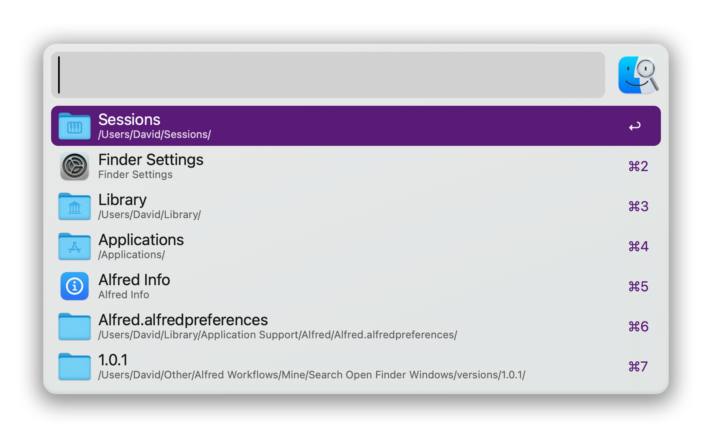
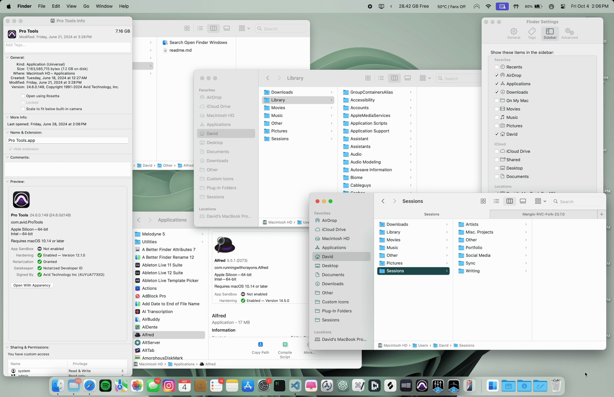

# Search Open Finder Windows — Alfred Workflow

Search a list of your open Finder windows, copy paths to their open directories, and close them.

Works with:

* **Finder browser** windows *(the standard ones that show the contents of folders)*
* **Get Info** windows
* **Settings** *(Preferences)* windows

### Usage

* **Default action:** Focus window
* **Command (⌘):** 
  * For **Finder browser** windows: Copy path to window target *(current directory)*
  * For **get info** windows: Copy path to item of information window

* **Option (⌥):** Close window

### Matching

#### You can search for:

* **Name** of window
* **Index** of window *(starts at **1** is frontmost window)*
* For **Finder browser** windows:
  * **Path** *(and **directories in path**)* to the window's target
  * **Contents** *(files and folders)* of the window's current directory
* For **get info** windows:
  * **Path** *(and **directories in path**)* of file or folder shown in window

### Icons

This workflow uses macOS' default folder icons *(with support for folder types and system appearance)* for most listed items *(files and folders)*. If an item has a **nonstandard icon** *(i.e. app icon, user-set custom icon)*, it will use that icon.

### Examples

#### Focus window - default action

#### Copy directory path - command (⌘)

#### Close window - option (⌥)

### Acknowledgements

This workflow was inspired by the **[Browser Tabs](https://alfred.app/workflows/epilande/browser-tabs/)** workflow by [**Emmanuel Pilande**](https://github.com/epilande).

In order to retrieve the custom icons, decoding of macOS resource forks is required. I wouldn't have known how to do that without examining the [**fileicon**](https://github.com/mklement0/fileicon) shell script by [**mklement** ](https://github.com/mklement0).

Big thanks to these devs (even though they don't know me) for low-key teaching me how to make this workflow!

Enjoy!